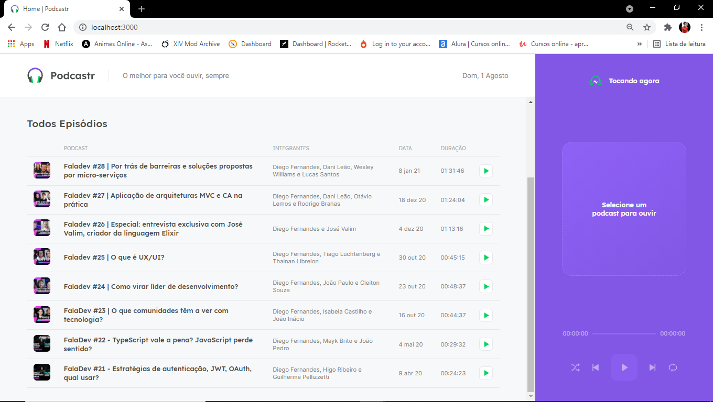

<h1 align="center">
  
</h1>

  <a href="#-project">Project</a>&nbsp;&nbsp;&nbsp;|&nbsp;&nbsp;&nbsp;
  <a href="#-technologies">Technologies</a>&nbsp;&nbsp;&nbsp;|&nbsp;&nbsp;&nbsp;
  <a href="#-services-used">Services Used</a>&nbsp;&nbsp;&nbsp;|&nbsp;&nbsp;&nbsp;
  <a href="#-getting-started">Getting Started</a>&nbsp;&nbsp;&nbsp;|&nbsp;&nbsp;&nbsp;
  <a href="#-how-to-use">How To Use</a>&nbsp;&nbsp;&nbsp;|&nbsp;&nbsp;&nbsp;
  <a href="#-features">Features</a>&nbsp;&nbsp;&nbsp;|&nbsp;&nbsp;&nbsp;
  <a href="#-layout">Layout</a>&nbsp;&nbsp;&nbsp;|&nbsp;&nbsp;&nbsp;
  <a href="#memo-license">License</a>

 

  

 

  

## 💻 Project

Podcastr is an app for playing audio episodes of your favorite podcast.

  

## 🚀 Technologies

This project was developed using these techs:

- [React](https://reactjs.org)
- [Next.js](https://nextjs.org/)
- [TypeScript](https://www.typescriptlang.org/)
- [Sass](https://sass-lang.com/documentation)
- [JSON Server (Fake API)](https://github.com/typicode/json-server)

 

## 👨‍🔧 Services Used
- GitHub
- JSON Server
 

## 🎮 Getting Started

If you want run this code, you can start cloning the repository using HTTP or SSH key.

- Open your gitBash (git terminal)
- Type `git clone`
- Insert the HTTP or SSH key (on windows, shift + insert to paste on gitBash)
- You can find this HTTP or SSH Key by clicking on `Code` on the top right in this repository

- Once cloned you can open the project in your IDE and enter the codes below in the IDE terminal

 > Tip: Open 2 terminals: One to start the server and the other to run the app.  

`yarn` To add the dependencies on the project.  

 

### Option 1: 

`yarn server` To run the fake API.  

`yarn dev` Runs the app in the development mode.\
Open [http://localhost:3000](http://localhost:3000) to view it in the browser.

 

### Option 2 - Using this option you can see the SSG on action:
`yarn build` To build the app.  

`yarn server` To run the fake API.  

`yarn start` Runs the app\
Open [http://localhost:3000](http://localhost:3000) to view it in the browser.

 

**Dependencies**
- Axios
- Sass
- Date-fns
- Rc-slider

 

## 📌 How to Use
### 1 - When you access the project, you will see the home page. In this page you can:
#### 1.1 - See all avaiable episodes
#### 1.2 - Play in a episode
#### 1.3 - Toggle shuffle episodes
#### 1.4 - Toggle repeat episode
#### 1.5 - Access an episode's information

### 2 - Episode page.
#### 2.1 - Also here you can play episode;
#### 2.2 - Come back to home page.

 

## 🕵 Features

The main features of the application are:
 - Access an episode information;
 - Play an episode;
 - Shuffle mode;
 - Repeat mode;
 - Each episode has its own page;
 - [SSG (Static Side Generation) and SSR (Server-side Rendering)](https://www.youtube.com/watch?v=u1kCtkVR7cE). 
 
 

## 🔖 Layout

You can see the layout of this project through [this link](https://www.figma.com/file/UwFEntsHpHYJlHNQAQr4gA/Podcastr/duplicate). It's necessary have an account on [Figma](https://figma.com) to access.

 

## :memo: License

This project is under MIT license.

 

 > In case of sensitive bugs like security vulnerabilities, please contact
 > <a href = "mailto:deywerson.pereira@gmail.com">deywerson.pereira@gmail.com</a> directly instead of using issue tracker. We value your effort
 > to improve the security and privacy of this project!
  
 
---
  

      
Please follow on github and join us! Thanks for visiting me and good coding!

Made with ♥ by <a href="https://github.com/deywersonp">Deywerson Pereira</a>
